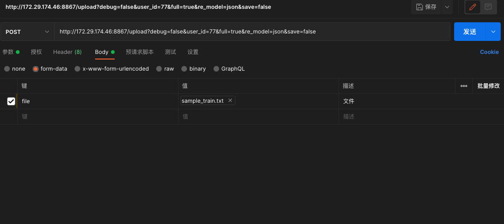

## 简单的写了个deepfm的flask

**大致流程:**


<br/>

post参数:


<br/>
<br/>

post Header参数:


<br/>
<br/>

post 文件参数(键记得改为文件类型):




<br/>

#### 启动服务

<br/>

在终端执行:
```bash
cd Docker/
sh start.sh
```

```python
# 执行post
import requests
 
url = 'http://127.0.0.1:8867/upload'
files = {'file': open('./work/PaddleRec/models/rank/deepfm/data/sample_data/train/sample_train.txt', 'rb')}           
params = {"debug":"true", "user_id":"11", "full":"false","re_model":"json","save":"false"}
  
response = requests.post(url, params=params, files=files)
json = response.text
print(json)
```