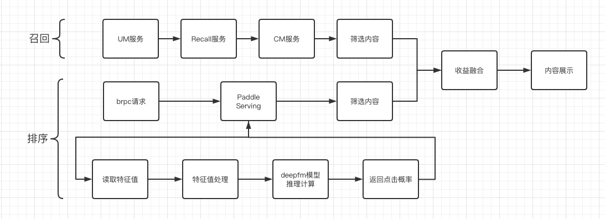

# Learn-DeepFM
本项目使用推荐系统中的多个模型进行对比，并基于Criteo数据集完成对点击率模型的训练和预测。也是对点击率模型的学习。

## 内容
* [项目说明](#项目说明)
* [安装说明](#安装说明)
* [数据准备](#数据准备)
* [模型选择](#模型选择)
* [模型训练](#模型训练)
* [模型评估](#模型评估)
* [模型预测](#模型预测)
* [模型导出](#模型导出)
* [模型推理](#模型推理)
* [模型优化](#模型优化)
* [模型部署](#模型部署)
* [文件清理](#文件清理)
* [TODO](#TODO)

<a name="项目说明"></a>

## 1 项目说明

据统计，2019年全国广告市场总体规模达8674.28亿元，较上年增长了8.54%（见图1），占国民生产总值（GDP）的0.88%。如今广告成为各短视频平台最重要的收入来源。

<center></center><center>图1.2009—2019中国广告经营额</center> 

针对短视频、搜索、资讯等场景，应用飞桨[PaddleRec](https://github.com/PaddlePaddle/PaddleRec/tree/master)的推荐算法技术，对召回数据进行排序最终展现给用户，最大限度吸引用户、留存用户、增加用户粘性、提高用户转化率。
<center></center>
<center></center>
<center></center>

<br/>

#### **推荐系统大致流程**

    ①产品接入推荐业务后

    ②经过brpc进行请求

    ③发送给服务器计算，得到点击概率值，筛选概率较低的值

    ④结合召回系统进行内容融合，加入收益相关内容

参考下图

<center></center>

#### 架构介绍:

    ①用户使用产品

    ②产品接入推荐业务

    ③召回:
     根据行为数据生成特征值, 生成用户模型;
     根据下发日志获取仓库数据资源, 生成内容模型
     对用户模型+内容模型进行显式和隐式召回

    ④排序:
     对下发历史记录合并去重
     进行粗排-->精排

    ⑤对排序和召回后的数据进行预测

    ⑥将预测结果加入广告等进行融合，最后返回给用户

参考下图

<center></center>

#### 个性化推荐:

    ①从内容库选取大量数据

    ②召回系统根据用户画像和用户行为进行初步筛选

    ③通过粗排、精排选择预估更符合用户兴趣的  

    ④增加广告等内容，重新排序，最后呈现给用户

参考下图

<center></center>

#### **方案难点**

* **推理速度要求高：** 在搜索中进行快速响应，增强用户使用体验，对模型推理速度有较高要求。
* **推理准确度要求：** 在实际应用中推荐内容是否准确，对模型的精确度有一定的要求。
* **推理召回率：** 根据用户的行为进行分析生成候选，再进行排序，最后呈现给用户。 
* **在离线一致性：** 如下图

<center></center>

#### **模型介绍**

<center></center>

其实DeepFM就是把Wide&Deep模型的wide部分改为了FM。

 * 黑色线---带权重的连接，代表了FM的一阶特征部分

 * 红色线---不带权重的连接，代表了二阶特征组合部分

 * 蓝色线---稀疏特征向稠密特征转换的embedding向量，并且这个embedding会随着训练而学习更新

由上面网络结构图可以看到，DeepFM模型主要包括如下模块：

 * 输入层（Sparse Features）：输入数据包括类别特征和连续特征；

 * Embedding层（Dense Embeddings）：该层的作用是对类别特征进行Embedding向量化，将离散特征映射为稠密特征。该层的结果同时提供给FM Layer和Hidden Layer，即FM Layer和Hidden Layer共享相同的Embedding层。

 * FM Layer：该模型主要提取一阶特征和两两交叉特征；

 * Hidden Layer：该模块主要是应用DNN模型结构，提取深层次的特征信息；
 
 * 输出层（Output Units）：对FM Layer和Hidden Layer的结果进行Sigmoid操作，得出最终的结果。表达式：
 $$\hat{y} = sigmoid(y_{FM} + y_{DNN})$$


其中$𝑦_{𝐹𝑀}$是FM模型的输出，而$𝑦_{𝐷𝑁𝑁}$是DNN的输出。

这里就不详细介绍每层的作用了，具体的参考论文: [DeepFM: A Factorization-Machine based Neural Network for CTR Prediction
](https://arxiv.org/pdf/1703.04247.pdf)

<a name="安装说明"></a>


## 2安装说明

#### 环境要求

* PaddlePaddle >=2.0
* Python >= 3.7
* 操作系统: Windows/Mac/Linux

  > Windows下PaddleRec目前仅支持单机训练，分布式训练建议使用Linux环境
  
### 安装Paddle

- gpu环境pip安装
  ```bash
  python -m pip install paddlepaddle-gpu==2.0.0 
  ```
- cpu环境pip安装
  ```bash
  python -m pip install paddlepaddle # gcc8 
  ```
更多版本下载可参考paddle官网[下载安装](https://www.paddlepaddle.org.cn/documentation/docs/zh/develop/install/index_cn.html)

### 下载PaddleRec

注意：官方维护github版本地址：  
[https://github.com/PaddlePaddle/PaddleRec](https://github.com/PaddlePaddle/PaddleRec)

```bash
git clone https://github.com/PaddlePaddle/PaddleRec/
cd PaddleRec
```

<br/>

#### 大致的文件分布

```bash
aistudio@jupyter-885527-3178715:~$ tree -L 3
.
├── AutoLog # AutoLog模块安装文件夹
│   ├── auto_log
│   └── .....
├── data # 排序数据集
│   ├── data123868 # 挂载数据集压缩包目录
│   │   ├── slot_test_data_full.tar.gz # 测试数据集压缩包
│   │   └── slot_train_data_full.tar.gz # 训练数据集压缩包
│   ├── slot_test_data_full # 测试数据集
│   │   ├── part-220 # 测试数据集
│   │   ├── part-221 # 测试数据集
│   │   └── ......
│   └── slot_train_data_full # 训练数据集
│       ├── part-0 # 训练数据集
│       ├── part-1 # 训练数据集
│       ├── part-10 # 训练数据集
│       └── ......
├── Docker # Flask服务源码
│   ├── common 
│   │   ├── config # 读取配置文件方法
│   │   ├── controller
│   │   ├── __init__.py
│   │   ├── lib
│   │   └── model
│   ├── config.ini # 配置文件
│   ├── config.ini.bak # 配置文件备份
│   ├── deepfm # 特征文件
│   │   └── data
│   ├── main.py
│   ├── README.md
│   ├── requirements.txt # 需要安装的环境
│   └── start.sh # 启动服务
├── Docker.zip # Flask服务源码压缩包
├── output_model_all_deepfm # 训练后模型文件
│   └── 0 # 第一次训练后文件
│       ├── rec.pdopt # 训练优化器的参数
│       ├── rec.pdparams # 训练网络的参数dict，key为变量名，value为Tensor array数值
│       ├── tostatic.pdiparams # 二进制Tensor存储格式
│       ├── tostatic.pdiparams.info # 推理用参数的*.pdiparams文件和保存兼容变量信息
│       └── tostatic.pdmodel # 模型结构
├── output_model_all_deepfm_epochs_4 # 训练四次后模型文件
│   ├── 0
│   │   ├── rec.pdopt
│   │   ├── rec.pdparams
│   │   ├── tostatic.pdiparams
│   │   ├── tostatic.pdiparams.info
│   │   └── tostatic.pdmodel
│   ├── 1
│   │   ├── rec.pdopt
│   │   └── rec.pdparams
│   ├── 2
│   │   ├── rec.pdopt
│   │   └── rec.pdparams
│   └── 3
│       ├── rec.pdopt
│       └── rec.pdparams
├── PaddleRec # PaddleRec源码
│   └── ......
└── PaddleRec.zip # PaddleRec源码压缩包
```


<a name="数据准备"></a>


## 3 数据准备

本案例使用数据集使用官方demo提供的数据集```./PaddleRec/models/rank/deepfefm/data/sample_data/train/sample_train.txt```，格式如下：

```
click:0 dense_feature:0.0 dense_feature:0.00497512437811 ... dense_feature:0.08 1:737395 2:210498 ... 26:306163
```

其中```click```表示是否被点击，点击用1表示，未点击用0表示。```dense_feature```代表连续特征值，共13个。```1```代表离散特征，共26个。相邻特征使用```\t```分隔，缺失用空格表示。


引用官方readme，示例文件为```PaddleRec/datasets/criteo/slot_train_data_full/part-0```：
```
<label> <integer feature 1> ... <integer feature 13> <categorical feature 1> ... <categorical feature 26>
```
其中```<label>```表示广告是否被点击，点击用1表示，未点击用0表示。```<integer feature>```代表数值特征（连续特征），共有13个连续特征。```<categorical feature>```代表分类特征（离散特征），共有26个离散特征。相邻两个特征用```\t```分隔，缺失特征用空格表示。测试集中```<label>```特征已被移除。  

```bash
# criteo全量数据集下载(4.2G)
cd PaddleRec/datasets/criteo
sh run.sh
cd ~/
```

<a name="模型选择"></a>

## 4 模型选择

 * DeepFM借鉴了Google的wide & deep的做法，其本质是

    1.将Wide & Deep 部分的wide部分由 人工特征工程+LR 转换为FM模型，避开了人工特征工程；

    2.FM模型与deep part共享feature embedding。

 * FM Component + Deep Component。FM提取低阶组合特征，Deep提取高阶组合特征。但是和Wide&Deep不同的是，DeepFM是端到端的训练，不需要人工特征工程。
 
 * 共享feature embedding。FM和Deep共享输入和feature embedding不但使得训练更快，而且使得训练更加准确。相比之下，Wide&Deep中，input vector非常大，里面包含了大量的人工设计的pairwise组合特征，增加了他的计算复杂度。

以下数据的详细配置在```doc/Model selection```

|       数据集        |       模型       |       训练loss        |       训练auc          |       预测auc         |
| :------------------: | :--------------------: | :---------: |:---------: | :---------: |
|       Criteo        |       DNN       |       0.44        |        0.79         |       0.79         |
|       Criteo        |       FM       |       --        |       0.78          |       --          |
|       Criteo        |       GateDnn       |       --        |       0.79          |       --          |
|       Criteo        |       DeepFM       |       0.44797        |       0.78          |       0.77214          |
|       criteo        |       Wide&Deep       |       0.76195         |       0.82          |       --          |
|       criteo        |       dcn       |       --         |       0.77          |       --          |
|       criteo        |       deepfefm       |       --         |       0.8028          |       --          |
|       criteo        |       DLRM       |       0.45         |       0.79          |       0.80          |
|       criteo        |       ffm       |       --         |       0.79          |       --          |
|       criteo        |       xDeepFM       |       --         |       0.78          |       0.79          |

<a name="模型训练"></a>


## 5 模型训练


本项目采用DeepFM作为点击率的模型，模型训练需要经过如下环节：

<center></center>

[自定义数据集及Reader](https://github.com/PaddlePaddle/PaddleRec/blob/master/doc/custom_reader.md)、[自定义模型](https://github.com/PaddlePaddle/PaddleRec/blob/master/doc/model_develop.md)、[yaml文件配置](https://github.com/PaddlePaddle/PaddleRec/blob/master/doc/yaml.md)

具体代码请参考```PaddleRec/models/rank/deepfm/config.yaml```，可修改参数：

**runner变量**

|             名称              |     类型     |             取值                 | 是否必须 |                               作用描述                               |
| :---------------------------: | :----------: | :--------------------------------: | :------: | :------------------------------------------------------------------: |
|         train_data_dir          |    string    |                       任意                        |    是    |                        指定训练数据目录                        |
|         train_reader_path          |    string    |                       任意                        |    是    |            指定训练时用的Reader()所在python文件地址            |
|         train_batch_size            |    int    |                       >= 1                       |    是    |                   指定train阶段的批训练样本数量                    |
|         model_save_path            |    string    |                       任意                       |    是    |                 指定train阶段完成后Save参数的地址                  |
|         test_data_dir              |    string    |                       任意                        |    是    |                        指定测试数据目录                        |
|         infer_reader_path          |    string    |                       任意                        |    是    |                指定测试时用的Reader()所在python文件地址                |
|         infer_batch_size            |    int    |                       >= 1                      |    是    |                   指定infer阶段的批训练样本数量                    |
|         infer_load_path            |    string    |                       任意                       |    是    |                 指定infer阶段开始时初始化模型地址                 |
|         infer_start_epoch            |    int    |                       >= 0                       |    是    |    初始化模型时从第几个epoch保留的参数开始加载（从0开始计数，包括本次）    |
|         infer_end_epoch            |    int    |                           >= 0                           |    是    |    初始化模型时到第几个epoch保留的参数停止加载（从0开始技术，不包括本次）    |
|         use_gpu            |    bool    |                  True/False                   |    是    |               指定是否使用gpu，若为False则默认使用cpu                |
|         epochs            |    int    |                       >= 1                       |    是    |                   指定train阶段需要训练几个epoch                    |
|         print_interval            |    int    |                       >= 1                       |    是    |                   训练指标打印batch间隔                    |
|         use_auc            |    bool    |                       True/False                       |    否    |                   在每个epoch开始时重置auc指标的值                    |
|         use_visual            |    bool    |                     True/False                      |    否    |                开启模型训练的可视化功能，开启时需要安装visualDL                   |
|         use_inference            |    bool    |                       True/False                       |    否    |                 是否使用save_inference_model接口保存                  |
|         save_inference_feed_varnames         |    list[string]    |                组网中指定Variable的name                 |    否    |                 预测模型的入口变量name                 |
|         save_inference_fetch_varnames         |    list[string]    |                组网中指定Variable的name                  |    否    |                 预测模型的出口变量name               |
|         use_fleet         |    bool    |                  True/False                  |    否    |                 指定是否使用分布式运行单机多卡或多机多卡                 |
|         reader_type         |    string    |                  QueueDataset/DataLoader/CustomizeDataLoader                |    否    |                 指定使用的reader类型                 |
|         model_init_path         |    string    |                  任意                  |    否    |                 指定是否使用热启动，在训练初期加载初始化模型                 |


**hyper_parameters变量**
|          名称           |  类型  |       取值       | 是否必须 |          作用描述           |
| :---------------------: | :----: | :--------------: | :------: | :-------------------------: |
|     optimizer.class     | string | SGD/Adam/Adagrad |    是    |       指定优化器类型        |
| optimizer.learning_rate | float  |       > 0        |    否    |         指定学习率          |
|           reg           | float  |       > 0        |    否    | L2正则化参数，只在SGD下生效 |
|         others          |   /    |        /         |    /     |   由各个模型组网独立指定    |


【名词解释】

* 动态图：在这种模式下，每次执行一个运算，可以立即得到结果（而不是事先定义好网络结构，然后再执行），PaddlePaddle2.0开始默认使用动态图模式[paddle动态图模型预测](https://www.paddlepaddle.org.cn/documentation/docs/zh/practices/quick_start/dynamic_graph.html#dongtaitu)。
* 静态图：静态图需要先构建再运行，优势是在运行前可以对图结构进行优化，比如常数折叠、算子融合等，可以获得更快的前向运算速度。[Paddle静态图预测部署](https://www.paddlepaddle.org.cn/documentation/docs/zh/guides/04_dygraph_to_static/export_model/basic_concept_cn.html#sanjingtaituyucebushu)


<br/>

#### 修改config

添加```use_visual: True```，用于模型可视化

官方demo示例：

```
runner:
  train_data_dir: "data/sample_data/train"
  train_reader_path: "criteo_reader" # importlib format
  use_gpu: True
  use_auc: True
  use_visual: True
  train_batch_size: 2
  epochs: 3
  print_interval: 2
...
```

全量数据，```config_bigdata.yaml```示例：

```
runner:
  train_data_dir: "../../../datasets/criteo/slot_train_data_full"
  train_reader_path: "criteo_reader" # importlib format
  use_gpu: True
  use_auc: True
  use_visual: True
  train_batch_size: 512
  epochs: 1
  print_interval: 10
...
```
 * 本文以动态图作为教程静态图等待补充 
```bash
# 先跑个官方demo
# 动态图训练
python -u ~/PaddleRec/tools/trainer.py -m ~/PaddleRec/models/rank/deepfm/config.yaml 
```
```bash
# 静态图训练
python -u ~/PaddleRec/tools/static_trainer.py -m ~/PaddleRec/models/rank/deepfm/config.yaml
```

```bash
# 再跑个criteo全量数据集 (此数据集可能要跑2小时!!!)
# 动态图训练
python -u ~/PaddleRec/tools/trainer.py -m ~/PaddleRec/models/rank/deepfm/config_bigdata.yaml
```

```output_model_all_deepfm_epochs_4/```为训练四次的结果


<a name="模型预测"></a>


## 6 模型预测

大致流程:


 * 官方demo小量数据集

```bash
# 动态图预测
python -u ~/PaddleRec/tools/infer.py -m ~/PaddleRec/models/rank/deepfm/config.yaml
```

```bash
# 静态图预测
python -u ~/PaddleRec/tools/static_infer.py -m ~/PaddleRec/models/rank/deepfm/config.yaml
```

 * criteo全量数据集

```bash
# 动态图预测
python -u ~/PaddleRec/tools/infer.py -m ~/PaddleRec/models/rank/deepfm/config_bigdata.yaml
```

```bash
# 静态图预测
python -u ~/PaddleRec/tools/static_infer.py -m ~/PaddleRec/models/rank/deepfm/config_bigdata.yaml
```


<a name="模型评估"></a>


## 7 模型评估

#### AUC

AUC面积（Area Under Curve），又称ROC曲线下的面积，它描述的是分类器C随机抽取的一个正例的预测概率大于一个负例的预测概率的概率。简单地说，就是做随机抽样时，P(P) ≥ P(N)中 ≥ 成立的概率。


<a name="模型可视化"></a>


## 8 模型可视化

根据日志目录的不同修改```[!请修改]```进行代码的修改```code/Visualize.py```文件

```bash
python code/Visualize.py
```


<a name="模型推理"></a>


## 9 模型推理

本项目采用DeepFM作为点击率的模型，模型推理需要经过如下环节：


<br/>
<br/>

【可能会用上的文档】

[1] [Linux端基础训练预测功能测试](https://github.com/PaddlePaddle/PaddleRec/blob/master/test_tipc/doc/test_train_inference_python.md)

```bash
# 保存模型
python -u ~/PaddleRec/tools/to_static.py -m ~/PaddleRec/models/rank/deepfm/config_bigdata_init.yaml
```

```bash
# 需要安装的库：
pip install pynvml psutil GPUtil

# 由于GitHub及其难下载，所以在aistudio内置此模块
# git clone https://github.com/LDOUBLEV/AutoLog.git
%cd ~/AutoLog
pip install -r requirements.txt
python setup.py bdist_wheel
pip install ./dist/auto_log-1.0.0-py3-none-any.whl
cd ../
```

 * 推理(criteo数据集)

```bash
python -u ~/PaddleRec/tools/paddle_infer.py --model_file=/home/aistudio/output_model_all_deepfm/0/tostatic.pdmodel --params_file=/home/aistudio/output_model_all_deepfm/0/tostatic.pdiparams --use_gpu=True --data_dir=./PaddleRec/models/rank/deepfm/data/sample_data/train --reader_file=./PaddleRec/models/rank/deepfm/criteo_reader.py --batchsize=5
```

**不同模式速度测试**

测试环境：

OS_version: Ubuntu 16.04

CUDA_version: 10.1.243

CUDNN_version: 7.3.1

drivier_version: 418.67

CPU: Intel(R) Xeon(R) Gold 6271C CPU @ 2.60GHz 4核

GPU: NVIDIA Tesla V100 SXM2 32GB

| 是否启用GPU | 是否开启tensorRT加速 | 是否开启mkldnn加速 | 线程数 | 批大小 | 是否开启内存优化器 | 开启IR优化 |         时长        | 
| --------- | ------------------ | ---------------- | ----- | ----- | --------------- | --------- | ------------------- |
| False     |        False       |        False     | 1     | 5     |       True      |   True    |   14分钟50秒482毫秒  |
| True     |        False       |        False     | 1     | 5     |       True      |   True    |   16分钟5秒771毫秒  |
| False     |        False       |        False     | 128     | 5     |       True      |   True    | 1小时12分钟15秒739毫秒 |
| False     |        False       |        True     | 1     | 5     |       True      |   True    |  18分钟2秒37毫秒 |
| False     |        False       |        False     | 1     | 2048  |       True      |   True    | 4分钟32秒14毫秒  |
| True     |        False       |        False     | 1     | 2048  |       True      |   True    | 4分钟14秒394毫秒  |

组合太多了，不一一跑了，欢迎补充。

详细的日志存储在```doc/ReasoningTest/results.md```文件中


<a name="模型优化"></a>


## 10 模型优化


在本项目示例中，仅使用默认配置进行了一轮的训练，模型还称不上训练到最优，已经有了基本的效果，如何继续优化呢？

<br/>

#### 调整超参

在PaddleRec中，我们已经将超参数都写在config.yaml中，所以只需要对config.yaml一个文件进行修改，就能够清晰的对比模型效果，并快速进行模型效果验证，极大的提升模型的迭代效率。

**增加训练轮数**

在训练模型的时候，效果较差可能是因为欠拟合引起的。我们可以增加训练的轮数，让模型获得更充分的训练，以此来提高模型的效果。

随着epoch 数量的增加， 权重更新迭代的次数增多， 曲线从最开始的不拟合状态， 进入优化拟合状态， 最终进入过拟合。


以本教程中```~/PaddleRec/models/rank/deepfm/config_bigdata.yaml```为例：


| 迭代次数 | 训练loss | 训练auc | 预测auc |
| ------ | ----------- | ------- | ------- |
|  1     |   0.44797   |   0.78  |  0.77214  |
|  4     |   0.47313   |   0.81  |  0.80526  |
|  10    |   0.46200   |   0.81  |  0.76423  |

**修改批大小**

在训练模型的时候，我们可以通过修改批大小，让模型获得更充分的训练，以此来提高模型的效果。
直观的理解：
Batch Size定义：一次训练所选取的样本数。
Batch Size的大小影响模型的优化程度和速度。同时其直接影响到GPU显存或者内存的使用情况，假如你GPU显存或者内存不大，该数值最好设置小一点。

以本教程中```~/PaddleRec/models/rank/deepfm/config_bigdata.yaml```为例：


| 批大小 | 训练loss | 训练auc | 预测auc |
| ------ | ----------- | ------- | ------- |
|  256   |   0.48464   |   0.77  |  0.75091  |
|  512   |   0.44797   |   0.78  |  0.77214  |
|  1024  |   0.48464   |   0.77  |  0.77433  |

**更换优化器**

在训练模型的时候，我们可以更换优化器，尝试不同的学习率以求获得提升。在PaddleRec中，我们提供SGD/Adam/AdaGrad优化器供您尝试。也可以通过learning_rate选项修改学习率。

* Adagrad它利用迭代次数和累积梯度，对学习率进行自动衰减，2011年提出。从而使得刚开始迭代时，学习率较大，可以快速收敛。而后来则逐渐减小，精调参数，使得模型可以稳定找到最优点。

* SGD全称Stochastic Gradient Descent，随机梯度下降，1847年提出。每次选择一个mini-batch，而不是全部样本，使用梯度下降来更新模型参数。它解决了随机小批量样本的问题，但仍然有自适应学习率、容易卡在梯度较小点等问题。

* Adam是SGDM和RMSProp的结合，它基本解决了之前提到的梯度下降的一系列问题，比如随机小样本、自适应学习率、容易卡在梯度较小点等问题。

仍然以本教程中```~/PaddleRec/models/rank/deepfm/config_bigdata.yaml```为例：


|   优化器  |  训练loss | 训练auc | 预测auc |
| -------- | ----------- | -------- | --------- |
|  Adam    |   0.44797   |   0.78   |  0.77214 |
|  SGD     |   0.47405   |   0.77   |  0.76693 |
|  AdaGrad |   0.47380   |   0.77   |  0.76598 |

**修改学习率**

也可以通过learning_rate选项修改学习率。

 * 学习率(Learning rate)作为监督学习以及深度学习中重要的超参，其决定着目标函数能否收敛到局部最小值以及何时收敛到最小值。合适的学习率能够使目标函数在合适的时间内收敛到局部最小值。

仍然以本教程中```~/PaddleRec/models/rank/deepfm/config_bigdata.yaml```为例：


| 学习率 | 训练loss | 训练auc | 预测auc |
| ------ | ----------- | ------- | --------- |
|  0.001    |   0.44797   |   0.78  |  0.77214 |
|  0.01     |   2.96769   |   0.51  |  0.49999 |
|  0.0001   |   0.46342   |   0.77  |  0.78671 |


**调整全连接层**

在训练模型的时候，我们可以很方便的指定模型的全连接层共有几层，以及每一层的维度。

 * 全连接层，是每一个结点都与上一层的所有结点相连，用来把前边提取到的特征综合起来。由于其全相连的特性，一般全连接层的参数也是最多的。

仍然以本教程中```~/PaddleRec/models/rank/deepfm/config_bigdata.yaml```为例：


|        全连接层      |  训练loss | 训练auc | 预测auc |
| ------------------- | ----------- | ------- | --------- |
|  [400, 400, 400]    |   0.44797   |   0.78  |  0.77214 |
|  [512, 256, 128]    |   0.47318   |   0.77  |  0.76565 |
|  [1024, 1024, 1024] |   0.47412   |   0.77  |  0.76702 |

<a name="模型部署"></a>


## 11 模型部署

**大致流程:**


#### **使用paddle serving进行c++部署(在aistudio不能执行):**

推荐使用docker搭建paddle serving

```bash
pip install paddle-serving-client -i https://mirror.baidu.com/pypi/simple
pip install paddle-serving-server -i https://mirror.baidu.com/pypi/simple
pip install paddle_serving_app -i https://mirror.baidu.com/pypi/simple
# 使用gpu需要安装
pip install paddle-serving-server-gpu -i https://mirror.baidu.com/pypi/simple
```

```python
# 导出serving需要使用的文件
import paddle_serving_client.io as serving_io
serving_io.inference_model_to_serving(
    dirname="output_model_all_deepfm/0/", 
    serving_server="serving_server", 
    serving_client="serving_client",  
    model_filename="tostatic.pdmodel", 
    params_filename="tostatic.pdiparams")
```

#### 启动服务

```bash
cd PaddleRec/models/rank/deepfm/
 python3 -m paddle_serving_server.serve --model serving_server --port 9393
```

测试部署服务：
```bash
python3 -u ../../../tools/rec_client.py --client_config=serving_client/serving_client_conf.prototxt --connect=0.0.0.0:9393 --use_gpu=false --data_dir=~/PaddleRec/datasets/criteo/slot_test_data_full --reader_file=criteo_reader.py --batchsize=5 --client_mode=rpc
```

返回值示例:

```bash
I1229 04:14:09.951630 93427 general_model.cpp:490] [client]logid=0,client_cost=19.238ms,server_cost=16.482ms.
{'sigmoid_0.tmp_0': array([[0.4066131 ],
       [0.98054665],
       [0.26659673],
       [0.9993316 ],
       [0.01065591]], dtype=float32)}
I1229 04:14:09.969341 93427 general_model.cpp:490] [client]logid=0,client_cost=14.159ms,server_cost=11.989ms.
{'sigmoid_0.tmp_0': array([[0.13911244],
       [0.4447395 ],
       [0.05189119],
       [0.09342456],
       [0.00317834]], dtype=float32)}
I1229 04:14:09.996845 93427 general_model.cpp:490] [client]logid=0,client_cost=23.606ms,server_cost=20.878ms.
{'sigmoid_0.tmp_0': array([[0.08483634],
       [0.6469881 ],
       [0.01495558],
       [0.6999975 ],
       [0.19809735]], dtype=float32)}

.....

I1229 04:14:10.145457 93427 general_model.cpp:490] [client]logid=0,client_cost=20.756ms,server_cost=15.508ms.
{'sigmoid_0.tmp_0': array([[1.0309319e-01],
       [3.3357497e-02],
       [7.7633208e-01],
       [9.9997580e-01],
       [1.3711449e-05]], dtype=float32)}
I1229 04:14:10.165000 93427 general_model.cpp:490] [client]logid=0,client_cost=12.866ms,server_cost=10.198ms.
{'sigmoid_0.tmp_0': array([[0.00725924],
       [0.60281265],
       [0.09260521],
       [0.03498047],
       [0.14035006]], dtype=float32)}
```

<br/>
<br/>

 #### **使用python Flask部署:**

 * post参数:


 * post Header参数:


 * post 文件参数(键记得改为文件类型):


#### 启动服务

在终端执行:
```bash
cd Docker/
sh start.sh
```

```python
# 执行post
import requests
 
url = 'http://127.0.0.1:8867/upload'
files = {'file': open('./PaddleRec/models/rank/deepfm/data/sample_data/train/sample_train.txt', 'rb')}           
params = {"debug":"false", "user_id":"11", "full":"false","re_model":"json","save":"false"}
  
response = requests.post(url, params=params, files=files)
json = response.text
print(json)
```

<br/>

返回值示例：

~~~json
{"code": 200, "dtype": "float32", "data": [[0.09755970537662506], [0.0018753863405436277], [0.5798191428184509], [0.03435799479484558], [0.2643408477306366], [0.2625846862792969], [0.007232798263430595], [0.1814028024673462], [0.008859287947416306], [0.42785409092903137], [0.02257639355957508], [0.8310312628746033], [0.6661034226417542], [0.18567033112049103], [0.07354680448770523], [0.06244637072086334]], "user_id": "11"}
~~~

<a name="文件清理"></a>

## 12 文件清理

```bash
# 清理数据集
cd ~/
rm -rf ~/PaddleRec/datasets/criteo/slot_train_data_full.tar.gz
rm -rf ~/PaddleRec/datasets/criteo/slot_test_data_full.tar.gz
rm -rf ~/PaddleRec/datasets/criteo/slot_train_data_full
rm -rf ~/PaddleRec/datasets/criteo/slot_test_data_full
```

<a name="TODO"></a>

## 13 TODO

 - [ ] 改进后的模型部署，日志会重复输出(暂时用强制退出解决)

 - [ ] 在aistuido平台使用模型部署时使用```--enable_tensorRT```进行加速时提示```请使用带有TensorR编译的Paddle推断库```[使用Paddle-TensorRT库预测](https://www.paddlepaddle.org.cn/documentation/docs/zh/1.8/advanced_guide/performance_improving/inference_improving/paddle_tensorrt_infer.html)

- [ ] 模型服务部署优化速度

- [ ] docker服务编写

<a name="参考资料"></a>

## 参考资料

**排名不分先后:**

 * [1] 2019中国广告年度数据报告: [http://mlzg.shiyan.gov.cn/html/2020/shiyan_whjy_0325/17402.html](http://mlzg.shiyan.gov.cn/html/2020/shiyan_whjy_0325/17402.html)

 * [2] PaddleRec: [https://github.com/PaddlePaddle/PaddleRec/tree/master](https://github.com/PaddlePaddle/PaddleRec/tree/master)

 * [3]基于 DeepFM 模型的点击率预估模型: [https://aistudio.baidu.com/aistudio/projectdetail/2251589?channelType=0&channel=0](https://aistudio.baidu.com/aistudio/projectdetail/2251589?channelType=0&channel=0)

 * [4]私人电影推荐: [https://aistudio.baidu.com/aistudio/projectdetail/1481839?channelType=0&channel=0](https://aistudio.baidu.com/aistudio/projectdetail/1481839?channelType=0&channel=0)

 * [5]神经网络中Batch Size的理解: [https://blog.csdn.net/qq_34886403/article/details/82558399](https://blog.csdn.net/qq_34886403/article/details/82558399)

 * [6]机器学习2 -- 优化器（SGD、SGDM、Adagrad、RMSProp、Adam）: [https://zhuanlan.zhihu.com/p/208178763](https://zhuanlan.zhihu.com/p/208178763)

 * [7]全连接层: [https://baike.baidu.com/item/%E5%85%A8%E8%BF%9E%E6%8E%A5%E5%B1%82](https://baike.baidu.com/item/%E5%85%A8%E8%BF%9E%E6%8E%A5%E5%B1%82)

 * [8]deepfm实践: [https://zhuanlan.zhihu.com/p/137894818](https://zhuanlan.zhihu.com/p/137894818)

 * [9]DeepFM: A Factorization-Machine based Neural Network for CTR Prediction : [https://arxiv.org/pdf/1703.04247.pdf](https://arxiv.org/pdf/1703.04247.pdf)

 * [10]PaddleServing: [https://github.com/PaddlePaddle/Serving](https://github.com/PaddlePaddle/Serving)

<a name="开源数据"></a>

## 开源数据

 * 非常感谢[PaddlePaddle](https://github.com/PaddlePaddle)和[Criteo](https://www.kaggle.com/c/criteo-display-ad-challenge/)开源的数据集