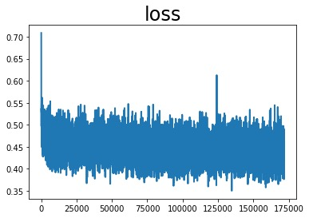
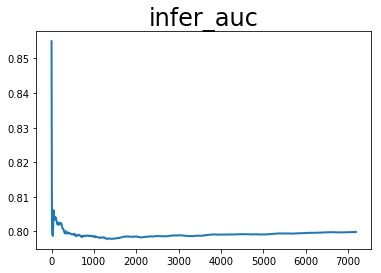
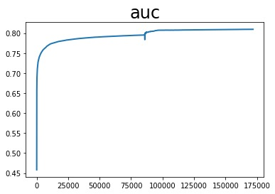

# DNN

auc_list累加值 13678.051133990288 平均值 0.7957907338835402
loss_list累加值 7717.111017018557 平均值 0.4489824887723154
infer_auc累加值 575.4397450089455 平均值 0.7992218680679798

配置文件：

```
runner:
  train_data_dir: "../../../datasets/criteo/slot_train_data_full"
  train_reader_path: "criteo_reader" # importlib format
  use_gpu: True
  use_auc: True
  use_visual: True
  train_batch_size: 512
  epochs: 4
  print_interval: 10
  model_save_path: "output_model_dnn_all"
  infer_reader_path: "criteo_reader" # importlib format
  test_data_dir: "../../../datasets/criteo/slot_test_data_full"
  infer_batch_size: 512
  infer_load_path: "output_model_dnn_all"
  infer_start_epoch: 0
  infer_end_epoch: 4

  #thread_num: 5
  #reader_type: "QueueDataset"  # DataLoader / QueueDataset / RecDataset
  #pipe_command: "python3.7 queuedataset_reader.py"
  #dataset_debug: False
  #split_file_list: False

# hyper parameters of user-defined network
hyper_parameters:
  # optimizer config
  optimizer:
    class: Adam
    learning_rate: 0.001
    strategy: async
  # user-defined <key, value> pairs
  sparse_inputs_slots: 27
  sparse_feature_number: 1000001
  sparse_feature_dim: 9
  dense_input_dim: 13
  fc_sizes: [512, 256, 128, 32]
  distributed_embedding: 0
```
<center></center>
<center></center>
<center></center>