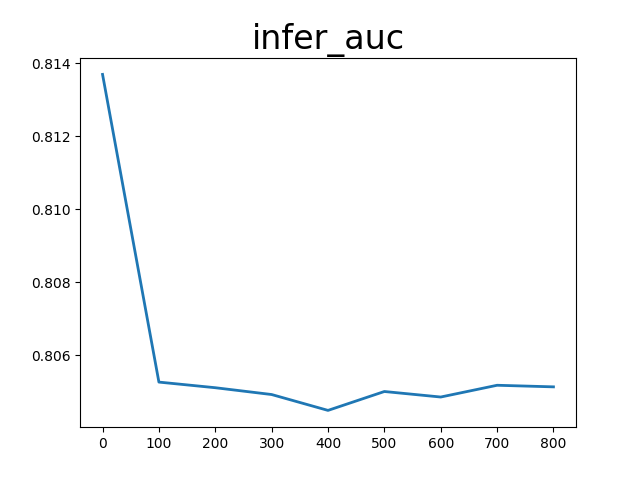
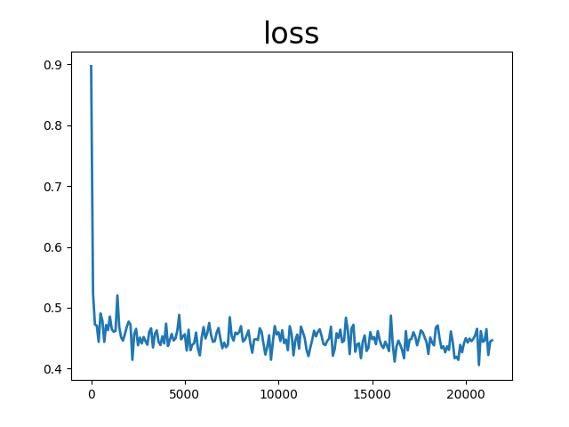

# Dlrm

auc_list累加值 170.6395618915558 平均值 0.7936723808909572
loss_list累加值 97.093108355999 平均值 0.4515958528186
infer_auc累加值 7.253701984882355 平均值 0.8059668872091506

配置文件：

```
runner:
  train_data_dir: "../../../datasets/criteo/slot_train_data_full"
  train_reader_path: "criteo_reader" # importlib format
  use_gpu: False
  use_auc: True
  use_visual: True
  train_batch_size: 2048
  epochs: 1
  print_interval: 100
  model_save_path: "output_model_dlrm"
  infer_batch_size: 2048
  infer_reader_path: "criteo_reader" # importlib format
  test_data_dir: "../../../datasets/criteo/slot_test_data_full"
  infer_load_path: "output_model_dlrm"
  infer_start_epoch: 0
  infer_end_epoch: 1

  # distribute_config
  sync_mode: "async"
  split_file_list: False
  thread_num: 1

# hyper parameters of user-defined network
hyper_parameters:
  # optimizer config
  optimizer:
    class: SGD
    learning_rate: 0.1
    strategy: async
  # user-defined <key, value> pairs
  sparse_inputs_slots: 27

  dense_input_dim: 13
  bot_layer_sizes: [512, 256, 64, 16]
  sparse_feature_number: 1000001
  sparse_feature_dim: 16
  top_layer_sizes: [512, 256, 2]
  num_field: 26
```
<center></center>
<center></center>
<center></center>