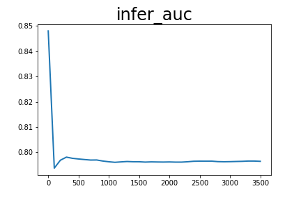
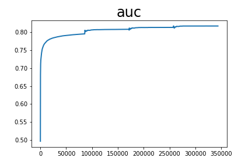

# GateDnn

auc_list累加值 2770.986435711384 平均值 0.8055193127067977

infer_auc累加值 28.72363841533661 平均值 0.7978788448704613

配置文件：

```
runner:
  train_data_dir: "../../../datasets/criteo/slot_train_data_full"
  train_reader_path: "criteo_reader" # importlib format
  use_gpu: False
  use_auc: True
  use_visual: True
  train_batch_size: 512
  epochs: 4
  print_interval: 100
  model_save_path: "output_model_gatednn_all"
  infer_batch_size: 512
  infer_reader_path: "criteo_reader" # importlib format
  test_data_dir: "../../../datasets/criteo/slot_test_data_full"
  infer_load_path: "output_model_gatednn_all"
  infer_start_epoch: 3
  infer_end_epoch: 4

# hyper parameters of user-defined network
hyper_parameters:
  # optimizer config
  optimizer:
    class: Adam
    learning_rate: 0.001
  # user-defined <key, value> pairs
  sparse_inputs_slots: 27
  sparse_feature_number: 1000001
  sparse_feature_dim: 9
  dense_input_dim: 13
  fc_sizes: [512, 256, 256]
  distributed_embedding: 0
  use_embedding_gate: True
  use_hidden_gate: True
```
<center></center>
<center></center>