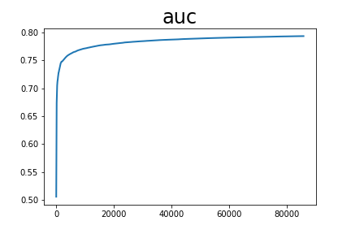

# Dlrm

auc_list累加值 6734.78226172924 平均值 0.7836609566824808
infer_auc累加值 285.9816448688507 平均值 0.7943934579690297

配置文件：

```
runner:
  train_data_dir: "../../../datasets/criteo/slot_train_data_full"
  train_reader_path: "criteo_reader" # importlib format
  use_gpu: True
  use_auc: True
  use_visual: True
  train_batch_size: 512
  epochs: 1
  print_interval: 10
  #model_init_path: "output_model/0" # init model
  model_save_path: "output_model_bigdata_deepfm_dy"
  test_data_dir: "../../../datasets/criteo/slot_test_data_full"
  infer_reader_path: "criteo_reader" # importlib formats
  infer_batch_size: 512
  infer_load_path: "output_model_bigdata_deepfm_dy"
  infer_start_epoch: 0
  infer_end_epoch: 1

# hyper parameters of user-defined network
hyper_parameters:
  # optimizer config
  optimizer:
    class: Adam
    learning_rate: 0.001
    strategy: async
  # user-defined <key, value> pairs
  sparse_inputs_slots: 27
  sparse_feature_number: 1000001
  sparse_feature_dim: 9
  dense_input_dim: 13
  fc_sizes: [400, 400, 400]
  distributed_embedding: 0
  layer_sizes_dnn: [400, 400]
  layer_sizes_cin: [200, 200, 200]
```
<center></center>
<center></center>