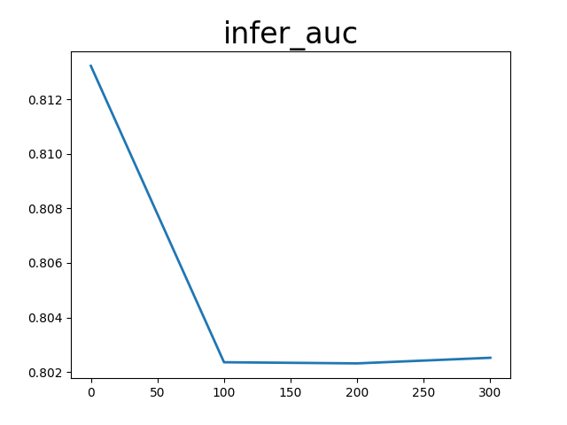
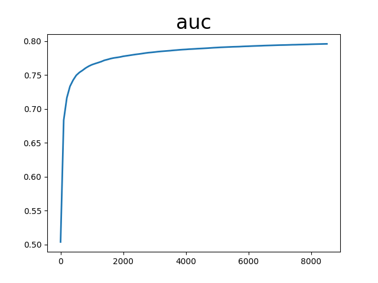
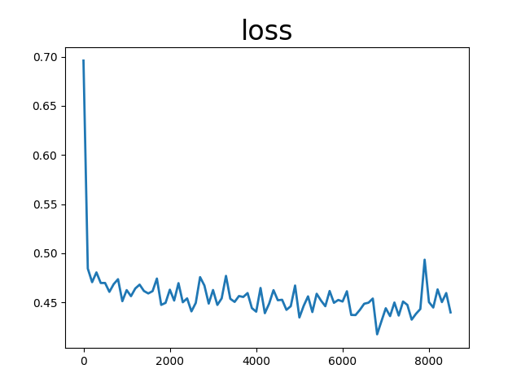

# deepfefm

auc_list累加值 67.00436896085739  平均值 0.7791205693122952

loss_list累加值 39.2797654569149 平均值 0.45674145880133604

infer_auc累加值 3.220421314239502 平均值 0.8051053285598755

配置文件：

```
runner:
  train_data_dir: "../../../datasets/criteo/slot_train_data_full"
  train_reader_path: "criteo_reader" # importlib format
  use_gpu: True
  use_auc: True
  use_visual: True
  train_batch_size: 5120
  epochs: 1
  print_interval: 100
  #model_init_path: "output_model/0" # init model
  model_save_path: "output_model_all_deepfefm"
  test_data_dir: "../../../datasets/criteo/slot_test_data_full"
  infer_reader_path: "criteo_reader" # importlib format
  infer_batch_size: 5120
  infer_load_path: "output_model_all_deepfefm"
  infer_start_epoch: 0
  infer_end_epoch: 1

# hyper parameters of user-defined network
hyper_parameters:
  # optimizer config
  optimizer:
    class: Adam
    learning_rate: 0.0005
    strategy: async
  # user-defined <key, value> pairs
  sparse_inputs_slots: 27
  sparse_feature_number: 1100005
  sparse_feature_dim: 48
  dense_input_dim: 13
  fc_sizes: [1024, 1024, 1024]
  distributed_embedding: 0
```
<center></center>
<center></center>
<center></center>