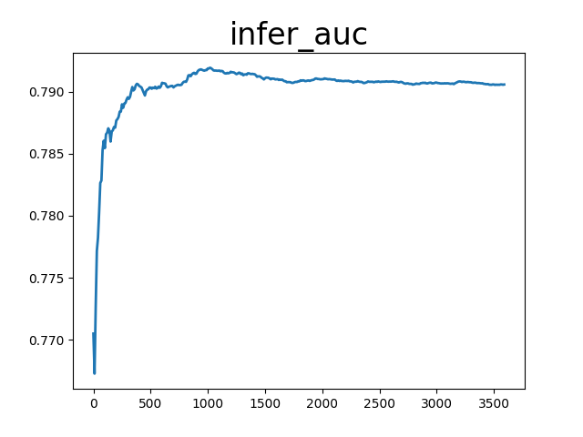

# ffm

auc_list累加值 802.4676786661148 平均值 0.7464815615498742

infer_auc累加值 284.52427059412 平均值 0.7903451960947778

配置文件：

```
runner:
  train_data_dir: "../../../datasets/criteo/slot_train_data_full"
  train_reader_path: "criteo_reader" # importlib format
  use_gpu: True
  use_auc: True
  use_visual: True
  train_batch_size: 4096
  epochs: 1
  print_interval: 10
  #model_init_path: "output_model/0" # init model
  model_save_path: "output_model_all_ffm"
  test_data_dir: "../../../datasets/criteo/slot_test_data_full"
  infer_reader_path: "criteo_reader" # importlib format
  infer_batch_size: 512
  infer_load_path: "output_model_all_ffm"
  infer_start_epoch: 0
  infer_end_epoch: 1

hyper_parameters:
  # optimizer config
  optimizer:
    class: Adam
    learning_rate: 0.001
    strategy: async
  # user-defined <key, value> pairs
  sparse_inputs_slots: 27
  sparse_feature_number: 1000001
  sparse_feature_dim: 9
  dense_input_dim: 13
```
<center></center>
<center></center>