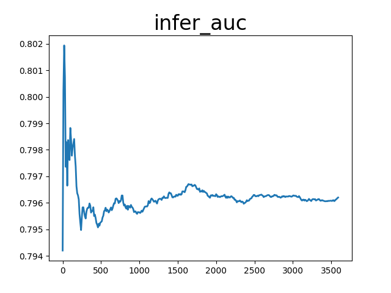
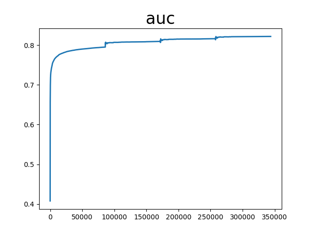
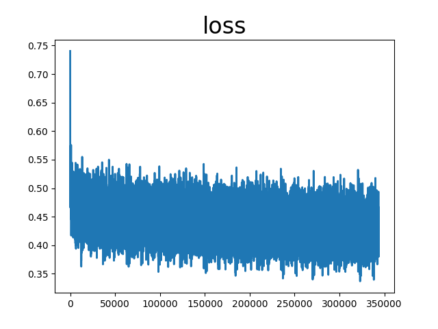

# wide&deep

auc_list累加值 27746.330585241318 平均值 0.8071425001524702

loss_list累加值 15143.028398633003 平均值 0.44051164762139294

infer_auc累加值 286.6335165500641 平均值 0.7962042126390669

配置文件：

```
runner:
  #train_data_dir: "data/slot_train_data_full"
  train_data_dir: "../../../datasets/criteo/slot_train_data_full"
  train_reader_path: "criteo_reader" # importlib format
  use_gpu: True
  use_auc: True
  use_visual: True
  train_batch_size: 512
  epochs: 4
  print_interval: 10
  #model_init_path: "output_model/0" # init model
  model_save_path: "output_model_all_wide_deep"
  test_data_dir: "../../../datasets/criteo/slot_test_data_full"
  infer_reader_path: "criteo_reader" # importlib format
  infer_batch_size: 512
  infer_load_path: "output_model_all_wide_deep"
  infer_start_epoch: 3
  infer_end_epoch: 4
  #use inference save model
  use_inference: False
  save_inference_feed_varnames: ["C1","C2","C3","C4","C5","C6","C7","C8","C9","C10","C11","C12","C13","C14","C15","C16","C17","C18","C19","C20","C21","C22","C23","C24","C25","C26","dense_input"]
  save_inference_fetch_varnames: ["sigmoid_0.tmp_0"]
  #use fleet
  use_fleet: False

# hyper parameters of user-defined network
hyper_parameters:
  # optimizer config
  optimizer:
    class: Adam
    learning_rate: 0.001
    strategy: async
  # user-defined <key, value> pairs
  sparse_inputs_slots: 27
  sparse_feature_number: 1000001
  sparse_feature_dim: 9
  dense_input_dim: 13
  fc_sizes: [512, 256, 128, 32]
  distributed_embedding: 0
```
<center></center>
<center></center>
<center></center>